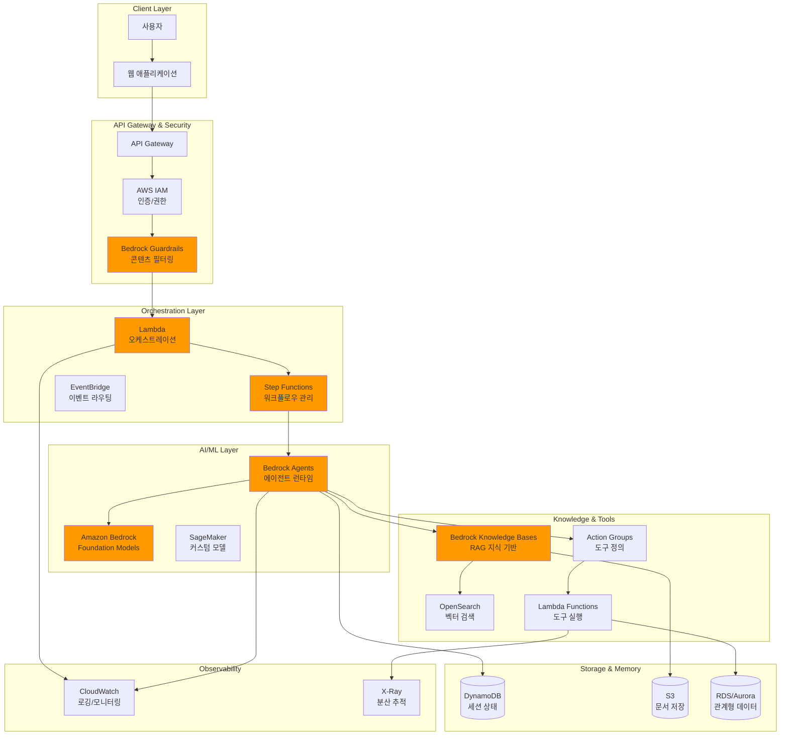
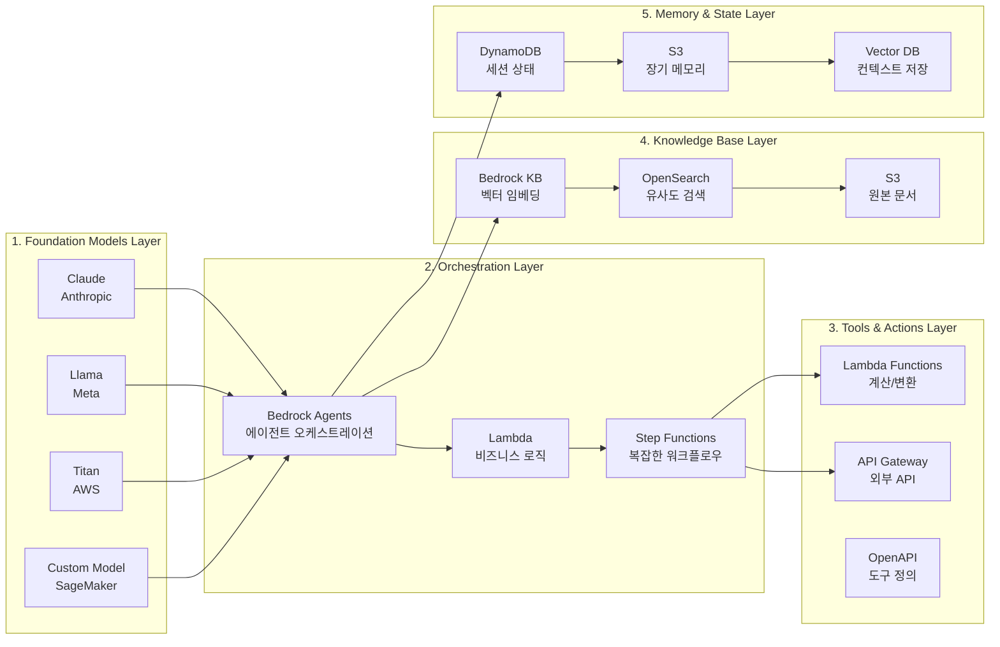
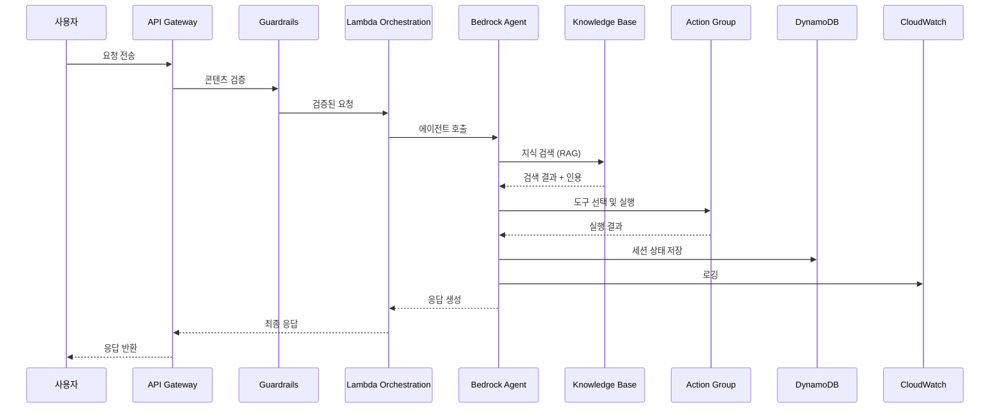

# AWS AI Agent Architecture Best Practices

## 목차
1. [개요](#개요)
2. [핵심 아키텍처 구성요소](#핵심-아키텍처-구성요소)
3. [아키텍처 설계 원칙](#아키텍처-설계-원칙)
4. [Best Practices 상세](#best-practices-상세)
5. [보안 및 거버넌스](#보안-및-거버넌스)
6. [운영 및 모니터링](#운영-및-모니터링)
7. [아키텍처 구성도](#아키텍처-구성도)
8. [참고 아키텍처 패턴](#참고-아키텍처-패턴)

---

## 개요

AWS의 AI Agent Architecture는 단순한 대화형 챗봇이 아닌, **자율적인 의사결정과 행동 실행이 가능한 에이전트 시스템**을 구축하기 위한 아키텍처입니다. 핵심은 **자동화, 추론, 지식 근거(grounding), 보안, 관찰성(observability)**을 확보하는 것입니다.

### 주요 특징
- **도구 호출(Tool Invocation)**: 외부 API, 데이터베이스, 서비스와의 통합
- **지식 기반 활용**: RAG(Retrieval-Augmented Generation)를 통한 엔터프라이즈 데이터 활용
- **실행 가능한 워크플로우**: 단순 응답 생성이 아닌 실제 작업 수행
- **오류 복원(Resilience)**: 장애 대응 및 복구 메커니즘
- **거버넌스(Governance)**: 보안, 규정 준수, 감사 추적

---

## 핵심 아키텍처 구성요소

### 1. 레이어 구조

| 레이어 | 역할 | 주요 AWS 서비스 |
|--------|------|----------------|
| **Foundation Models** | Agent의 추론 및 계획 수립 | Amazon Bedrock, SageMaker |
| **Orchestration** | 다단계 작업 조정, 도구 선택, 워크플로우 제어 | Lambda, Step Functions, EventBridge |
| **Tools / Action Groups** | 외부 API 호출, 계산, DB 접근 | Lambda, API Gateway, OpenAPI |
| **Knowledge Base** | 문서, 데이터베이스, 벡터 스토리지 | Bedrock Knowledge Bases, OpenSearch, S3 |
| **Memory / Session State** | 장기 메모리, 세션 상태, 사용자 히스토리 | DynamoDB, S3, Vector DB |
| **Security & Governance** | 인증/권한, 암호화, Guardrails | IAM, KMS, Bedrock Guardrails |
| **Observability** | 로그, 추적, 모니터링 | CloudWatch, X-Ray, OpenTelemetry |

### 2. 주요 AWS 서비스

#### AI/ML 서비스
- **Amazon Bedrock**: Foundation Models 관리 및 Agent 런타임
- **Amazon Bedrock Agents**: 에이전트 오케스트레이션
- **Amazon Bedrock Knowledge Bases**: RAG를 위한 지식 베이스
- **Amazon Bedrock Guardrails**: 콘텐츠 필터링 및 정책 적용
- **Amazon SageMaker**: 커스텀 모델 훈련 및 배포

#### 오케스트레이션 및 컴퓨팅
- **AWS Lambda**: 서버리스 함수 실행
- **AWS Step Functions**: 복잡한 워크플로우 오케스트레이션
- **Amazon EventBridge**: 이벤트 기반 아키텍처

#### 스토리지 및 데이터베이스
- **Amazon S3**: 문서 및 객체 저장
- **Amazon DynamoDB**: 세션 상태 및 메타데이터 저장
- **Amazon OpenSearch**: 벡터 검색 및 지식 검색
- **Amazon RDS / Aurora**: 관계형 데이터 저장

#### 보안 및 거버넌스
- **AWS IAM**: 접근 제어 및 권한 관리
- **AWS KMS**: 암호화 키 관리
- **AWS Secrets Manager**: 시크릿 관리

#### 관찰성
- **Amazon CloudWatch**: 로깅 및 모니터링
- **AWS X-Ray**: 분산 추적
- **OpenTelemetry**: 표준화된 관찰성

---

## 아키텍처 설계 원칙

### 1. Agent 스코프 명확화 (Scoping)
- **원칙**: 각 에이전트의 역할, 도메인, 사용 가능한 도구, 권한을 명확히 정의
- **이유**: 복잡성 감소, 보안 위험 감소, 유지보수성 향상
- **실행**:
  - 단일 "슈퍼 에이전트" 대신 역할별로 분리된 마이크로 에이전트 구조
  - 각 에이전트의 책임 범위 문서화
  - 도메인별 전문화된 에이전트 설계

### 2. 모듈화 및 분리 (Modularity & Separation)
- **원칙**: 작고 집중된 마이크로 에이전트 구조
- **이유**: 확장성, 유지보수성, 장애 격리
- **실행**:
  - 역할별 에이전트 분리 (예: 검색 에이전트, 분석 에이전트, 실행 에이전트)
  - 에이전트 간 명확한 인터페이스 정의
  - 독립적인 배포 및 스케일링 가능

### 3. 결정론적 로직 vs LLM 활용 균형
- **원칙**: 가능하면 결정론적 로직 사용, LLM은 추론과 복잡한 의도 해석에만 활용
- **이유**: 비용 절감, 지연 시간 감소, 예측 가능성 향상
- **실행**:
  - 데이터 유효성 검증, 형식 검증은 코드로 처리
  - LLM은 추론, 의도 해석, 도구 선택에 사용
  - 결과에 대한 검증(guardrails, validation) 필수

### 4. 안정성 및 복원력 (Resilience)
- **원칙**: Fault Isolation, Fallback 메커니즘, 재시도 전략
- **이유**: 단일 장애점 제거, 시스템 안정성 확보
- **실행**:
  - 구성 요소 간 경계 분리
  - 타임아웃 설정 및 Circuit Breaker 패턴
  - Fallback 경로 및 Human Escalation 메커니즘
  - 부하 예측 및 스케일링 준비

### 5. 관찰성 우선 설계 (Observability First)
- **원칙**: 전체 워크플로우 추적, 로깅, 모니터링
- **이유**: 디버깅, 성능 최적화, 문제 해결
- **실행**:
  - Trace ID를 통한 전체 요청 추적
  - 프롬프트, 응답, 도구 호출 로깅
  - 실시간 모니터링 및 알림 설정

---

## Best Practices 상세

### 1. RAG + 지식 기반 통합

#### 권장 사항
- **Knowledge Base 구축**: 엔터프라이즈 데이터를 벡터화하여 검색 가능하게 구성
- **인용(Citation) 제공**: 응답에 출처 정보 포함하여 신뢰성 확보
- **지식 최신성 유지**: 정기적인 데이터 동기화 및 업데이트

#### 구현 방법
```python
# 예시: Bedrock Knowledge Base 활용
- Amazon Bedrock Knowledge Bases 설정
- 데이터 소스 연결 (S3, RDS 등)
- 벡터 임베딩 및 인덱싱
- 검색 결과를 프롬프트에 포함
- 인용 정보를 응답에 첨부
```

### 2. 프롬프트 및 Action 정의 관리

#### 권장 사항
- **명확한 Schema 정의**: 도구(Action)의 입력/출력 스키마 명확히 정의
- **버전 관리**: 프롬프트 템플릿, Action 정의를 버전 관리
- **테스트 파이프라인**: 자동화된 테스트 및 평가 파이프라인 구축

#### 구현 방법
- OpenAPI 스펙을 활용한 Action 정의
- Git을 통한 프롬프트 템플릿 버전 관리
- CI/CD 파이프라인에 테스트 단계 포함
- A/B 테스트를 통한 프롬프트 최적화

### 3. 보안 중심 설계 (Security by Design)

#### IAM 최소 권한 원칙
- 각 에이전트, Action Group에 최소한의 권한만 부여
- 역할 기반 접근 제어(RBAC) 구현
- 정기적인 권한 검토 및 정리

#### 데이터 보호
- **암호화**: KMS를 사용한 데이터 암호화 (저장 시, 전송 시)
- **Customer Managed Keys**: 고객 관리형 키 사용
- **PII 처리**: 민감 정보 탈식별화 및 필터링

#### 입력/출력 검증
- **Guardrails**: Bedrock Guardrails를 통한 콘텐츠 필터링
- **Prompt Injection 방지**: 사용자 입력 검증 및 필터링
- **출력 검증**: 생성된 응답의 유효성 검사

### 4. 멀티 에이전트 협업 패턴

#### 워크플로우 에이전트 vs 협업형 에이전트
- **워크플로우 에이전트**: 순차적, 규칙 기반 작업에 적합
- **협업형 에이전트**: 복잡한 작업, 동적 의사결정에 적합

#### 구현 예시
```
Coordinator Agent
  ├── Search Agent (지식 검색)
  ├── Analysis Agent (데이터 분석)
  ├── Execution Agent (작업 실행)
  └── Validation Agent (결과 검증)
```

### 5. 점진적 확장 전략 (Crawl-Walk-Run)

#### 단계별 접근
1. **Crawl**: 내부 사용자 대상, 제한된 기능
2. **Walk**: 확장된 사용자 그룹, 추가 기능
3. **Run**: 전체 사용자 대상, 멀티 에이전트 협업

#### 이점
- 리스크 감소
- 점진적 학습 및 개선
- 안정성 확보

### 6. 비용 및 성능 최적화

#### 모델 선택 전략
- **경량 모델**: 단순 쿼리, 빠른 응답 필요 시
- **고성능 모델**: 복잡한 분석, 정확도 중요 시
- **하이브리드 접근**: 작업 유형에 따라 모델 선택

#### 최적화 기법
- **프롬프트 캐싱**: 반복적인 프롬프트 캐싱
- **병렬 처리**: 독립적인 작업 병렬 실행
- **비동기 처리**: 장시간 작업은 비동기로 처리
- **함수 호출 최소화**: 불필요한 도구 호출 감소

---

## 보안 및 거버넌스

### 1. Guardrails 구현

#### Amazon Bedrock Guardrails 활용
- **콘텐츠 필터링**: 불법, 증오 발언, 민감 주제 필터링
- **정책 적용**: 조직 수준의 정책 자동 적용
- **사용자 정의 필터**: 도메인별 커스텀 필터 설정

### 2. 프롬프트 템플릿 관리

#### 보안 조치
- **접근 제어**: 누가 프롬프트를 변경할 수 있는지 제한
- **리뷰 절차**: 변경 사항에 대한 승인 프로세스
- **감사 추적**: 모든 변경 사항 로깅 및 추적
- **버전 관리**: Git을 통한 버전 관리

### 3. 책임 있는 AI (Responsible AI)

#### 구현 사항
- **투명성**: 사용자에게 에이전트의 한계 알림
- **편향 방지**: 모델 편향 모니터링 및 완화
- **프라이버시**: 사용자 데이터 보호 및 개인정보 처리
- **규정 준수**: 관련 법규 및 표준 준수

### 4. 사용자 확인 메커니즘

#### 확인이 필요한 작업
- 데이터 변경 작업
- 권한 사용 작업
- 외부 시스템 호출
- 민감한 정보 접근

---

## 운영 및 모니터링

### 1. 로깅 및 추적

#### 필수 로그 항목
- **Agent Invocation**: 에이전트 호출 로그
- **Trace Events**: 전체 워크플로우 추적
- **Tool Invocation**: 도구 호출 내역
- **프롬프트 및 응답**: 입력/출력 로깅

#### 구현 방법
- CloudWatch Logs를 통한 중앙 집중식 로깅
- X-Ray를 통한 분산 추적
- OpenTelemetry를 통한 표준화된 관찰성

### 2. 모니터링 지표

#### 핵심 지표
- **Latency**: 응답 시간, 각 단계별 지연 시간
- **Error Rate**: 에러 발생률, 실패율
- **Tool Failure Rate**: 도구 호출 실패율
- **Cost**: 토큰 사용량, 비용 추적
- **정확도**: 응답 품질, 사용자 만족도

#### 알림 설정
- 임계값 기반 알림
- 이상 징후 탐지
- 자동화된 대응 메커니즘

### 3. 테스트 및 평가

#### 테스트 전략
- **단위 테스트**: 개별 컴포넌트 테스트
- **통합 테스트**: 전체 워크플로우 테스트
- **A/B 테스트**: 프롬프트 및 모델 비교 테스트
- **시나리오 테스트**: 다양한 사용자 시나리오 테스트

#### 평가 지표
- 정확도, 관련성, 완전성
- 응답 시간, 처리량
- 비용 효율성
- 사용자 만족도

### 4. 인프라 자동화 (IaC)

#### 권장 사항
- **CloudFormation / CDK**: 인프라 코드화
- **Terraform**: 멀티 클라우드 지원
- **재현성**: 동일한 환경 재현 가능
- **버전 관리**: 인프라 변경 사항 추적

---

## 아키텍처 구성도

### 전체 아키텍처 개요

다음은 AWS AI Agent Architecture의 전체 구성도를 나타냅니다:



### 레이어별 상세 구성도



### 데이터 흐름도



---

## 참고 아키텍처 패턴

### 1. Grounded Agent Workflow Pattern

```
사용자 입력
    ↓
Intent Parsing / 전처리 (Lambda)
    ↓
지식 기반 검색 (Bedrock Knowledge Bases)
    ↓
도구 선택 (Action Group)
    ↓
추론 (LLM via Bedrock)
    ↓
응답 생성 + 인용 + 확인
    ↓
로깅 & 추적
```

### 2. 서버리스 AI 아키텍처

```
API Gateway
    ↓
Lambda (인증/권한)
    ↓
Step Functions (워크플로우 오케스트레이션)
    ├── Lambda (전처리)
    ├── Bedrock (추론)
    ├── Lambda (도구 호출)
    └── Lambda (후처리)
    ↓
DynamoDB (상태 저장)
S3 (데이터 저장)
CloudWatch (모니터링)
```

### 3. 멀티 에이전트 협업 패턴

```
Coordinator Agent
    ├── Search Agent → Knowledge Base
    ├── Analysis Agent → Data Processing
    ├── Execution Agent → External APIs
    └── Validation Agent → Result Verification
    ↓
Shared Memory (DynamoDB / S3)
```

---

## 체크리스트

### 설계 단계
- [ ] Agent 스코프 및 역할 명확히 정의
- [ ] 모듈화된 아키텍처 설계
- [ ] 보안 요구사항 정의
- [ ] 모니터링 및 로깅 전략 수립

### 구현 단계
- [ ] IAM 최소 권한 원칙 적용
- [ ] Guardrails 설정
- [ ] Knowledge Base 구축
- [ ] Action Groups 정의 및 구현
- [ ] 에러 처리 및 Fallback 메커니즘 구현

### 운영 단계
- [ ] 모니터링 대시보드 구축
- [ ] 알림 설정
- [ ] 정기적인 보안 검토
- [ ] 성능 최적화
- [ ] 비용 모니터링

---

## 참고 자료

- [AWS Prescriptive Guidance - Agentic AI](https://docs.aws.amazon.com/prescriptive-guidance/latest/agentic-ai-foundations/generative-ai-agents.html)
- [AWS Architecture Blog - Resilient Generative AI Agents](https://aws.amazon.com/blogs/architecture/build-resilient-generative-ai-agents/)
- [Amazon Bedrock Best Practices](https://aws.amazon.com/blogs/machine-learning/best-practices-for-building-robust-generative-ai-applications-with-amazon-bedrock-agents-part-1/)
- [AWS Security Reference Architecture - Generative AI](https://docs.aws.amazon.com/prescriptive-guidance/latest/security-reference-architecture-generative-ai/gen-ai-agents.html)

