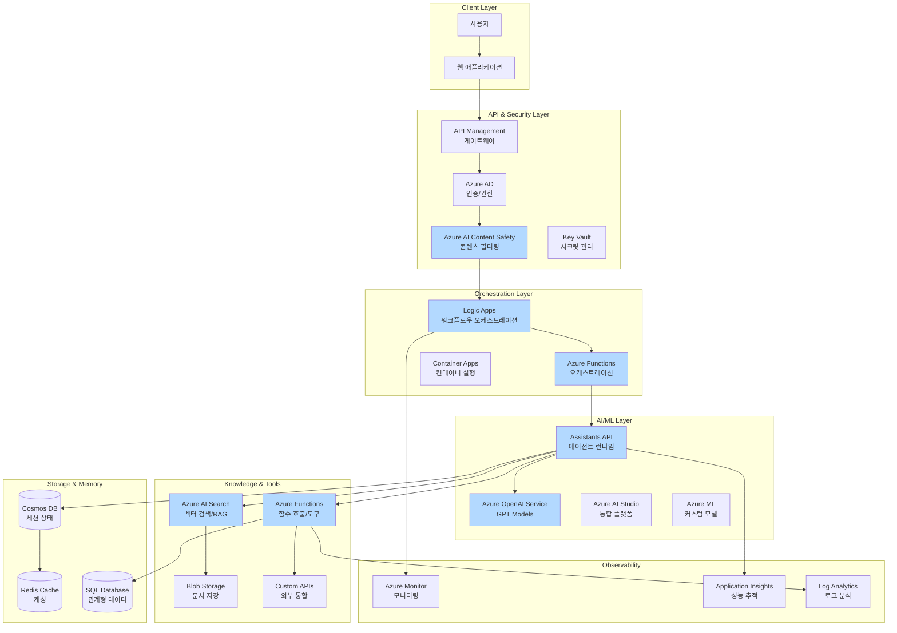
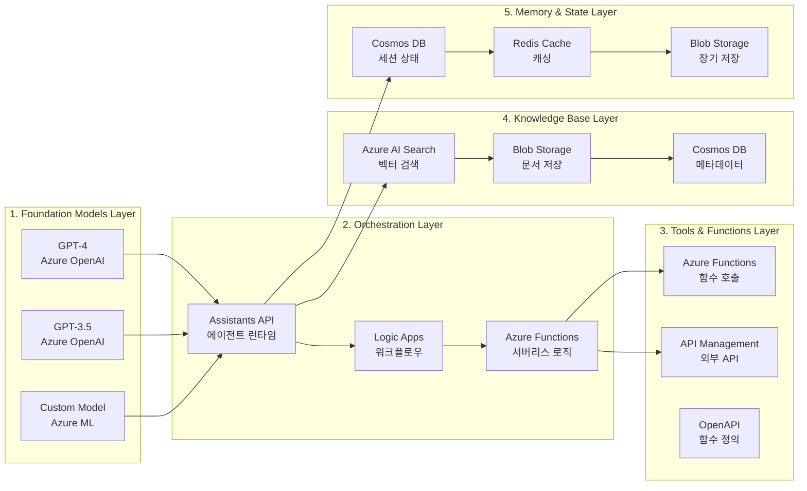
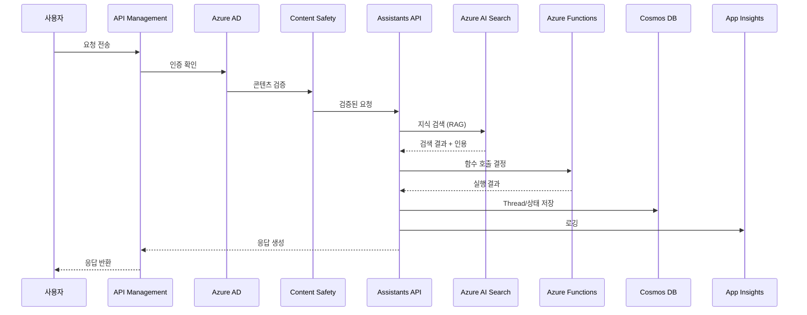

# Azure AI Agent Architecture Best Practices

## 목차
1. [개요](#개요)
2. [핵심 아키텍처 구성요소](#핵심-아키텍처-구성요소)
3. [아키텍처 설계 원칙](#아키텍처-설계-원칙)
4. [Best Practices 상세](#best-practices-상세)
5. [보안 및 거버넌스](#보안-및-거버넌스)
6. [운영 및 모니터링](#운영-및-모니터링)
7. [아키텍처 구성도](#아키텍처-구성도)
8. [Application ↔ Agent 통신 패턴](#application--agent-통신-패턴)
9. [참고 아키텍처 패턴](#참고-아키텍처-패턴)

---

## 개요

Azure의 AI Agent Architecture는 **Azure OpenAI Service**와 **Azure AI Studio**를 중심으로 한 에이전트 시스템 구축을 위한 아키텍처입니다. 핵심은 **함수 호출(Function Calling)**, **도구 통합(Tool Integration)**, **RAG(Retrieval-Augmented Generation)**, **보안**, **관찰성(Observability)**을 확보하는 것입니다.

### 주요 특징
- **함수 호출(Function Calling)**: Azure OpenAI의 함수 호출 기능을 통한 외부 시스템 통합
- **Assistants API**: 대화형 에이전트 구축을 위한 관리형 서비스
- **Azure AI Search 통합**: RAG를 위한 벡터 검색 및 지식 기반
- **Azure Functions 통합**: 서버리스 함수를 통한 도구 실행
- **보안 및 규정 준수**: Azure의 엔터프라이즈급 보안 기능 활용

---

## 핵심 아키텍처 구성요소

### 1. 레이어 구조

| 레이어 | 역할 | 주요 Azure 서비스 |
|--------|------|-------------------|
| **Foundation Models** | Agent의 추론 및 계획 수립 | Azure OpenAI Service, Azure AI Studio |
| **Orchestration** | 다단계 작업 조정, 도구 선택, 워크플로우 제어 | Azure Functions, Logic Apps, Azure Container Apps |
| **Tools / Functions** | 외부 API 호출, 계산, DB 접근 | Azure Functions, API Management, Custom APIs |
| **Knowledge Base** | 문서, 데이터베이스, 벡터 스토리지 | Azure AI Search, Azure Blob Storage, Azure Cosmos DB |
| **Memory / Session State** | 장기 메모리, 세션 상태, 사용자 히스토리 | Azure Cosmos DB, Azure Cache for Redis, Azure Storage |
| **Security & Governance** | 인증/권한, 암호화, Content Safety | Azure AD, Key Vault, Azure AI Content Safety |
| **Observability** | 로그, 추적, 모니터링 | Azure Monitor, Application Insights, Log Analytics |

### 2. 주요 Azure 서비스

#### AI/ML 서비스
- **Azure OpenAI Service**: GPT 모델 및 함수 호출 기능
- **Azure AI Studio**: 통합 AI 개발 플랫폼
- **Azure AI Search**: 벡터 검색 및 RAG 구현
- **Azure AI Content Safety**: 콘텐츠 필터링 및 안전성 검사
- **Azure Machine Learning**: 커스텀 모델 훈련 및 배포

#### 오케스트레이션 및 컴퓨팅
- **Azure Functions**: 서버리스 함수 실행
- **Azure Logic Apps**: 워크플로우 오케스트레이션
- **Azure Container Apps**: 컨테이너 기반 애플리케이션 실행
- **Azure App Service**: 웹 애플리케이션 호스팅

#### 스토리지 및 데이터베이스
- **Azure Blob Storage**: 문서 및 객체 저장
- **Azure Cosmos DB**: 세션 상태 및 메타데이터 저장
- **Azure Cache for Redis**: 세션 캐싱 및 메모리 저장
- **Azure SQL Database**: 관계형 데이터 저장

#### 보안 및 거버넌스
- **Azure Active Directory (Azure AD)**: 인증 및 권한 관리
- **Azure Key Vault**: 시크릿 및 암호화 키 관리
- **Azure Private Link**: 프라이빗 네트워크 연결
- **Azure Policy**: 거버넌스 정책 적용

#### 관찰성
- **Azure Monitor**: 로깅 및 모니터링
- **Application Insights**: 애플리케이션 성능 모니터링
- **Log Analytics**: 중앙 집중식 로그 분석

---

## 아키텍처 설계 원칙

### 1. Agent 스코프 명확화 (Scoping)
- **원칙**: 각 에이전트의 역할, 도메인, 사용 가능한 함수, 권한을 명확히 정의
- **이유**: 복잡성 감소, 보안 위험 감소, 유지보수성 향상
- **실행**:
  - 단일 "슈퍼 에이전트" 대신 역할별로 분리된 마이크로 에이전트 구조
  - 각 에이전트의 책임 범위 문서화
  - 함수 호출 범위 제한

### 2. 함수 호출 및 도구 통합
- **원칙**: 명확한 함수 정의, 스키마 검증, 에러 처리
- **이유**: 안정성, 예측 가능성, 디버깅 용이성
- **실행**:
  - OpenAPI 스펙을 활용한 함수 정의
  - 함수 호출 전 입력 검증
  - 함수 실행 결과 검증 및 에러 처리

### 3. RAG 및 지식 기반 통합
- **원칙**: Azure AI Search를 활용한 벡터 검색 및 지식 기반 구축
- **이유**: 정확한 응답, 인용 가능한 소스, 최신 정보 활용
- **실행**:
  - Azure AI Search 인덱스 구성
  - 문서 임베딩 및 벡터화
  - 검색 결과를 프롬프트에 포함
  - 인용 정보 제공

### 4. 안정성 및 복원력 (Resilience)
- **원칙**: Fault Isolation, Retry 메커니즘, Fallback 전략
- **이유**: 단일 장애점 제거, 시스템 안정성 확보
- **실행**:
  - Azure Functions의 재시도 정책 설정
  - Circuit Breaker 패턴 구현
  - Fallback 경로 및 Human Escalation 메커니즘
  - 다중 리전 배포 고려

### 5. 보안 우선 설계 (Security First)
- **원칙**: 최소 권한, 암호화, 입력/출력 검증
- **이유**: 데이터 보호, 규정 준수, 신뢰성 확보
- **실행**:
  - Azure AD를 통한 역할 기반 접근 제어
  - Key Vault를 통한 시크릿 관리
  - Azure AI Content Safety를 통한 콘텐츠 필터링
  - Private Endpoint를 통한 네트워크 격리

---

## Best Practices 상세

### 1. Azure OpenAI Assistants API 활용

#### 권장 사항
- **Assistants API 사용**: 대화형 에이전트 구축 시 Assistants API 활용
- **Thread 관리**: 사용자별 대화 스레드 관리 및 상태 유지
- **함수 정의**: 명확한 함수 스키마 정의 및 문서화

#### 구현 방법
```python
# 예시: Assistants API 활용
- Assistant 생성 시 함수 정의
- Thread를 통한 대화 컨텍스트 관리
- Run을 통한 에이전트 실행
- 함수 호출 결과 처리
```

### 2. Azure AI Search 통합 (RAG)

#### 권장 사항
- **인덱스 구성**: 문서 타입별 인덱스 구성
- **벡터 검색**: 임베딩 기반 유사도 검색
- **하이브리드 검색**: 키워드 검색과 벡터 검색 조합

#### 구현 방법
- Azure AI Search 인덱스 생성
- 문서 임베딩 및 인덱싱
- 검색 쿼리 최적화
- 검색 결과를 프롬프트에 포함

### 3. Azure Functions를 통한 도구 실행

#### 권장 사항
- **함수 분리**: 각 도구를 독립적인 함수로 구현
- **에러 처리**: 명확한 에러 메시지 및 재시도 로직
- **비동기 처리**: 장시간 작업은 비동기로 처리

#### 구현 방법
- HTTP 트리거 함수 생성
- 함수 입력/출력 스키마 정의
- Azure AD 인증 통합
- Application Insights를 통한 모니터링

### 4. 세션 및 상태 관리

#### 권장 사항
- **Cosmos DB 활용**: 세션 상태 및 대화 히스토리 저장
- **Redis 캐싱**: 자주 사용되는 데이터 캐싱
- **TTL 설정**: 자동 만료 정책 설정

#### 구현 방법
- Cosmos DB 컨테이너 설계
- 세션 키 기반 데이터 저장
- Redis를 통한 캐싱 전략
- 상태 동기화 메커니즘

### 5. 보안 및 콘텐츠 안전성

#### Azure AI Content Safety 활용
- **유해 콘텐츠 필터링**: 입력 및 출력 콘텐츠 검사
- **정책 설정**: 조직 수준의 정책 적용
- **사용자 정의 필터**: 도메인별 커스텀 필터 설정

#### 구현 방법
- Content Safety API 통합
- 입력 검증 파이프라인 구성
- 출력 필터링 로직 구현
- 정책 위반 시 알림 및 로깅

### 6. 점진적 확장 전략 (Crawl-Walk-Run)

#### 단계별 접근
1. **Crawl**: 내부 사용자 대상, 제한된 기능
2. **Walk**: 확장된 사용자 그룹, 추가 기능
3. **Run**: 전체 사용자 대상, 멀티 에이전트 협업

#### 이점
- 리스크 감소
- 점진적 학습 및 개선
- 안정성 확보

### 7. 비용 및 성능 최적화

#### 모델 선택 전략
- **경량 모델**: 단순 쿼리, 빠른 응답 필요 시
- **고성능 모델**: 복잡한 분석, 정확도 중요 시
- **하이브리드 접근**: 작업 유형에 따라 모델 선택

#### 최적화 기법
- **토큰 사용 최소화**: 프롬프트 최적화
- **캐싱 전략**: 반복적인 응답 캐싱
- **병렬 처리**: 독립적인 작업 병렬 실행
- **비동기 처리**: 장시간 작업은 비동기로 처리

### 8. Application ↔ Agent 공유 DB + Vector Store 구축

#### 아키텍처 패턴

**패턴 1: Azure PostgreSQL + pgvector 통합 패턴**
- **구성**: Azure Database for PostgreSQL + pgvector Extension
- **특징**:
  - Application 데이터와 벡터 임베딩을 동일 DB에 저장
  - 단일 데이터베이스에서 관계형 쿼리와 벡터 검색 지원
  - 트랜잭션 일관성 보장
- **적합한 경우**:
  - 소규모~중규모 데이터
  - 관계형 데이터와 벡터 데이터가 밀접하게 연관
  - 운영 단순화가 우선
- **구현 방법**:
  - Azure Database for PostgreSQL Flexible Server 생성
  - pgvector extension 활성화
  - 벡터 컬럼 추가 및 인덱스 생성
  - Application과 Agent가 동일 DB 접근

**패턴 2: Azure AI Search + Cosmos DB 패턴**
- **구성**: Azure AI Search (Vector Search) + Azure Cosmos DB
- **특징**:
  - Azure AI Search를 Vector Store로 사용
  - Cosmos DB에 Application 데이터 및 세션 상태 저장
  - 관리형 Vector Search 서비스
- **적합한 경우**:
  - 대규모 벡터 데이터
  - 고성능 벡터 검색 필요
  - 관리형 서비스 선호
- **구현 방법**:
  - Azure AI Search 인덱스 생성 (벡터 필드 포함)
  - Cosmos DB 컨테이너 설계
  - 데이터 동기화 파이프라인 구성
  - Application과 Agent가 동일 리소스 공유

**패턴 3: 하이브리드 패턴 (Cosmos DB + AI Search + Redis)**
- **구성**:
  - Cosmos DB: Application 데이터 및 세션 상태
  - Azure AI Search: Vector Store 및 RAG 검색
  - Azure Cache for Redis: 자주 사용되는 데이터 캐싱
  - Azure Blob Storage: 원본 문서 저장
- **특징**:
  - 각 구성 요소별 최적화
  - 독립적 스케일링
  - 데이터 동기화 필요
- **적합한 경우**:
  - 대규모 데이터
  - 고성능 벡터 검색 필요
  - 각 구성 요소별 독립적 관리 필요

#### 데이터 동기화 전략
- **Azure Functions**: 이벤트 트리거 기반 동기화
- **Logic Apps**: 워크플로우 기반 동기화
- **Azure Data Factory**: 배치 및 실시간 동기화

#### 접근 제어 및 보안
- **Azure AD 인증**: 서비스 주체 기반 인증
- **Private Endpoint**: 프라이빗 네트워크 연결
- **Key Vault**: 시크릿 및 연결 문자열 관리
- **암호화**: 전송 중 및 저장 시 암호화

#### 참고 자료
- [Azure Database for PostgreSQL - pgvector Extension](https://learn.microsoft.com/azure/postgresql/flexible-server/how-to-use-pgvector)
- [Azure AI Search Vector Search](https://learn.microsoft.com/azure/search/vector-search-overview)
- [Azure Cosmos DB + Azure AI Search 통합](https://learn.microsoft.com/azure/search/search-howto-index-cosmosdb)

---

## 보안 및 거버넌스

### 1. Azure AD 통합

#### 인증 및 권한 관리
- **서비스 주체 사용**: 애플리케이션별 서비스 주체 생성
- **최소 권한 원칙**: 필요한 권한만 부여
- **조건부 액세스**: 위치, 디바이스 기반 접근 제어

### 2. Key Vault를 통한 시크릿 관리

#### 권장 사항
- **API 키 관리**: OpenAI API 키를 Key Vault에 저장
- **연결 문자열**: 데이터베이스 연결 문자열 관리
- **인증서 관리**: SSL/TLS 인증서 관리

### 3. 네트워크 보안

#### Private Endpoint 활용
- **프라이빗 연결**: Azure 서비스 간 프라이빗 연결
- **네트워크 격리**: VNet 통합 및 NSG 규칙
- **방화벽 규칙**: IP 기반 접근 제어

### 4. 데이터 보호

#### 암호화
- **전송 중 암호화**: TLS 1.2 이상 사용
- **저장 시 암호화**: Azure Storage 암호화
- **고객 관리형 키**: Key Vault를 통한 키 관리

### 5. 책임 있는 AI (Responsible AI)

#### 구현 사항
- **투명성**: 사용자에게 에이전트의 한계 알림
- **편향 방지**: 모델 편향 모니터링 및 완화
- **프라이버시**: 사용자 데이터 보호 및 개인정보 처리
- **규정 준수**: GDPR, HIPAA 등 관련 법규 준수

---

## 운영 및 모니터링

### 1. 로깅 및 추적

#### 필수 로그 항목
- **에이전트 호출**: Assistants API 호출 로그
- **함수 실행**: Azure Functions 실행 로그
- **검색 쿼리**: Azure AI Search 쿼리 로그
- **프롬프트 및 응답**: 입력/출력 로깅 (민감 정보 제외)

#### 구현 방법
- Application Insights를 통한 중앙 집중식 로깅
- Log Analytics를 통한 로그 분석
- 사용자 정의 차원 및 메트릭 추가

### 2. 모니터링 지표

#### 핵심 지표
- **Latency**: 응답 시간, 각 단계별 지연 시간
- **Error Rate**: 에러 발생률, 실패율
- **Function Failure Rate**: 함수 호출 실패율
- **Cost**: 토큰 사용량, 비용 추적
- **정확도**: 응답 품질, 사용자 만족도

#### 알림 설정
- 임계값 기반 알림
- 이상 징후 탐지
- 자동화된 대응 메커니즘

### 3. 테스트 및 평가

#### 테스트 전략
- **단위 테스트**: 개별 함수 테스트
- **통합 테스트**: 전체 워크플로우 테스트
- **A/B 테스트**: 프롬프트 및 모델 비교 테스트
- **시나리오 테스트**: 다양한 사용자 시나리오 테스트

#### 평가 지표
- 정확도, 관련성, 완전성
- 응답 시간, 처리량
- 비용 효율성
- 사용자 만족도

### 4. 인프라 자동화 (IaC)

#### 권장 사항
- **ARM Templates**: Azure Resource Manager 템플릿
- **Bicep**: 선언적 인프라 코드
- **Terraform**: 멀티 클라우드 지원
- **재현성**: 동일한 환경 재현 가능
- **버전 관리**: 인프라 변경 사항 추적

---

## 아키텍처 구성도

### 전체 아키텍처 개요

다음은 Azure AI Agent Architecture의 전체 구성도를 나타냅니다:



### 레이어별 상세 구성도



### 데이터 흐름도



---

## Application ↔ Agent 통신 패턴

### 1. 비동기 호출 패턴 (Asynchronous Invocation) - 기본 패턴

#### Assistants API Run Polling 패턴
- **용도**: Azure OpenAI Assistants API의 기본 통신 방식
- **특징**:
  - Run 생성 → 비동기 실행 → Polling으로 상태 확인
  - 장시간 작업 처리 가능
  - Thread 기반 대화 컨텍스트 관리
- **사용 사례**:
  - 복잡한 멀티스텝 작업
  - 함수 호출이 필요한 작업
  - 장시간 실행 작업

#### 구현 예시
```python
# Assistants API 비동기 실행
# 1. Run 생성
run = client.beta.threads.runs.create(
    thread_id=thread_id,
    assistant_id=assistant_id,
    instructions=user_message
)

# 2. Polling으로 완료 대기
while run.status in ['queued', 'in_progress']:
    time.sleep(1)
    run = client.beta.threads.runs.retrieve(
        thread_id=thread_id,
        run_id=run.id
    )

# 3. 결과 확인
if run.status == 'completed':
    messages = client.beta.threads.messages.list(thread_id=thread_id)
```

#### 장점
- 장시간 작업 처리 가능
- 복잡한 워크플로우 지원
- Thread 기반 상태 관리

#### 단점
- Polling 오버헤드
- 실시간 피드백 어려움
- 구현 복잡도 증가

### 2. 동기 호출 패턴 (Synchronous Invocation)

#### Chat Completions API 직접 호출
- **용도**: 즉시 응답이 필요한 간단한 작업
- **특징**:
  - 단일 요청-응답 사이클
  - 낮은 지연 시간
  - Streaming 응답 지원
- **사용 사례**:
  - 간단한 질의응답
  - 빠른 정보 검색
  - 실시간 채팅

#### 구현 예시
```python
# Chat Completions API 동기 호출
response = client.chat.completions.create(
    model="gpt-4",
    messages=[
        {"role": "system", "content": system_prompt},
        {"role": "user", "content": user_message}
    ],
    functions=function_definitions,
    stream=True  # Streaming 지원
)
```

#### 장점
- 낮은 지연 시간
- 실시간 사용자 피드백
- 간단한 구현

#### 단점
- 타임아웃 제약
- 장시간 작업에 부적합
- 복잡한 워크플로우 처리 어려움

### 3. Function Calling 통신 패턴

#### Azure Functions를 통한 도구 실행
- **용도**: 에이전트가 외부 시스템과 통신하는 방식
- **특징**:
  - HTTP 트리거 함수
  - OpenAPI 스펙 기반 함수 정의
  - 비동기 실행 가능
- **구성 요소**:
  - 함수 정의 (OpenAPI 스펙)
  - Azure Functions 실행
  - 결과 반환 및 처리

#### 구현 예시
```python
# Function 정의
functions = [
    {
        "name": "get_weather",
        "description": "Get current weather",
        "parameters": {
            "type": "object",
            "properties": {
                "location": {"type": "string"}
            }
        }
    }
]

# Function 호출 처리
if response.choices[0].message.function_call:
    function_name = response.choices[0].message.function_call.name
    function_args = json.loads(response.choices[0].message.function_call.arguments)
    
    # Azure Functions 호출
    result = call_azure_function(function_name, function_args)
```

### 4. Service Bus를 통한 비동기 메시징

#### 이벤트 기반 아키텍처
- **용도**: 완전 비동기 처리, 이벤트 기반 통신
- **특징**:
  - 메시지 큐 기반 통신
  - 확장 가능한 처리
  - 작업 상태 추적
- **사용 사례**:
  - 배치 처리
  - 이벤트 기반 워크플로우
  - 마이크로서비스 간 통신

#### 구현 예시
```python
# Service Bus 메시지 전송
from azure.servicebus import ServiceBusClient, ServiceBusMessage

servicebus_client = ServiceBusClient.from_connection_string(conn_str)
sender = servicebus_client.get_queue_sender(queue_name)

message = ServiceBusMessage(json.dumps({
    'assistant_id': assistant_id,
    'thread_id': thread_id,
    'user_message': user_message
}))

sender.send_messages(message)
```

### 5. Logic Apps를 통한 워크플로우 오케스트레이션

#### 시각적 워크플로우 설계
- **용도**: 복잡한 멀티스텝 에이전트 작업
- **특징**:
  - 시각적 워크플로우 디자이너
  - 다양한 커넥터 지원
  - 에러 처리 및 재시도 자동화
- **구성 요소**:
  - HTTP 트리거
  - Azure OpenAI 호출
  - Azure Functions 실행
  - 조건부 분기
  - 상태 저장

### 6. 통신 패턴 선택 기준

#### 동기 호출이 적합한 경우
- ✅ 즉시 응답이 필요한 사용자 인터랙션
- ✅ 짧은 처리 시간 (< 5초)
- ✅ 실시간 피드백이 중요한 UX
- ✅ 단순한 질의응답

#### 비동기 호출 (Assistants API)이 적합한 경우
- ✅ 장시간 실행 작업
- ✅ 멀티스텝 워크플로우
- ✅ 함수 호출이 필요한 작업
- ✅ Thread 기반 대화 컨텍스트 관리

#### Service Bus 비동기 메시징이 적합한 경우
- ✅ 완전 비동기 처리
- ✅ 배치 작업
- ✅ 이벤트 기반 아키텍처
- ✅ 마이크로서비스 간 통신

### 7. Thread 및 상태 관리

#### Thread 기반 대화 관리
- **Cosmos DB**: Thread 상태 저장
- **Redis Cache**: 자주 사용되는 데이터 캐싱
- **상태 동기화**: 동기/비동기 작업 간 상태 공유

#### 구현 고려사항
- Thread ID 설계 (사용자 ID + 세션 ID)
- 상태 일관성 보장
- Thread 복구 메커니즘
- TTL 설정으로 자동 정리

### 8. 에러 처리 및 재시도

#### Assistants API 에러 처리
- Run 상태 모니터링
- 실패 시 재시도 로직
- Dead Letter Queue 활용

#### Function Calling 에러 처리
- Azure Functions 재시도 정책
- Circuit Breaker 패턴
- Fallback 응답 제공

### 9. 참고 자료

- [Azure OpenAI Assistants API Documentation](https://learn.microsoft.com/azure/ai-services/openai/how-to/assistant)
- [Azure Functions Best Practices](https://learn.microsoft.com/azure/azure-functions/functions-best-practices)
- [Azure Service Bus Documentation](https://learn.microsoft.com/azure/service-bus-messaging/)
- [Azure Logic Apps Documentation](https://learn.microsoft.com/azure/logic-apps/)

---

## 참고 아키텍처 패턴

### 1. Assistants API 기반 패턴

```
사용자 입력
    ↓
Azure OpenAI Assistants API
    ↓
함수 호출 결정
    ↓
Azure Functions 실행
    ↓
Azure AI Search (RAG)
    ↓
응답 생성 + 인용
    ↓
Application Insights (로깅)
```

### 2. 서버리스 AI 아키텍처

```
API Management
    ↓
Azure Functions (인증/권한)
    ↓
Logic Apps (워크플로우 오케스트레이션)
    ├── Azure Functions (전처리)
    ├── Azure OpenAI (추론)
    ├── Azure Functions (도구 호출)
    └── Azure Functions (후처리)
    ↓
Cosmos DB (상태 저장)
Azure AI Search (지식 검색)
Application Insights (모니터링)
```

### 3. 멀티 에이전트 협업 패턴

```
Coordinator Agent (Logic Apps)
    ├── Search Agent → Azure AI Search
    ├── Analysis Agent → Azure Functions
    ├── Execution Agent → External APIs
    └── Validation Agent → Content Safety
    ↓
Shared Memory (Cosmos DB / Redis)
```

---

## 체크리스트

### 설계 단계
- [ ] Agent 스코프 및 역할 명확히 정의
- [ ] 함수 호출 스키마 정의
- [ ] 보안 요구사항 정의
- [ ] 모니터링 및 로깅 전략 수립

### 구현 단계
- [ ] Azure AD 최소 권한 원칙 적용
- [ ] Content Safety 설정
- [ ] Azure AI Search 인덱스 구축
- [ ] Azure Functions 구현 및 배포
- [ ] 에러 처리 및 Fallback 메커니즘 구현

### 운영 단계
- [ ] Application Insights 대시보드 구축
- [ ] 알림 설정
- [ ] 정기적인 보안 검토
- [ ] 성능 최적화
- [ ] 비용 모니터링

---

## 참고 자료

- [Azure OpenAI Service Documentation](https://learn.microsoft.com/azure/ai-services/openai/)
- [Azure AI Studio Documentation](https://learn.microsoft.com/azure/ai-studio/)
- [Azure AI Search Documentation](https://learn.microsoft.com/azure/search/)
- [Azure Functions Best Practices](https://learn.microsoft.com/azure/azure-functions/functions-best-practices)
- [Azure AI Content Safety](https://learn.microsoft.com/azure/ai-services/content-safety/)

