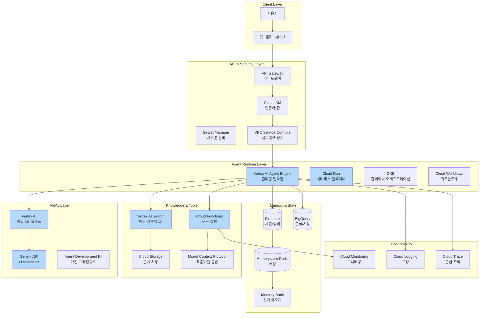
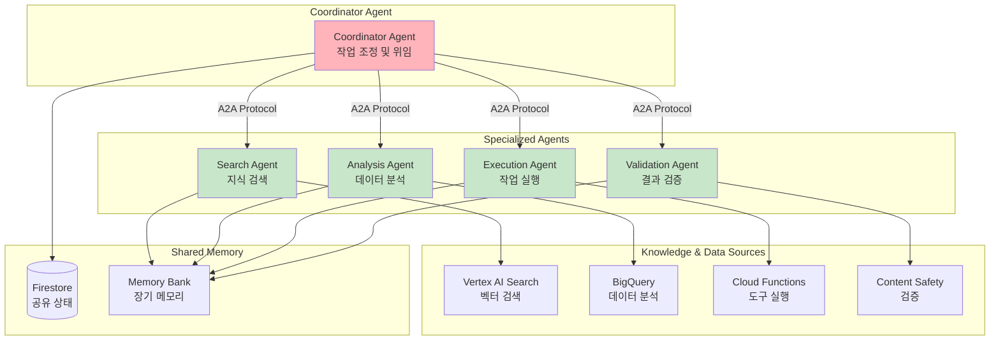
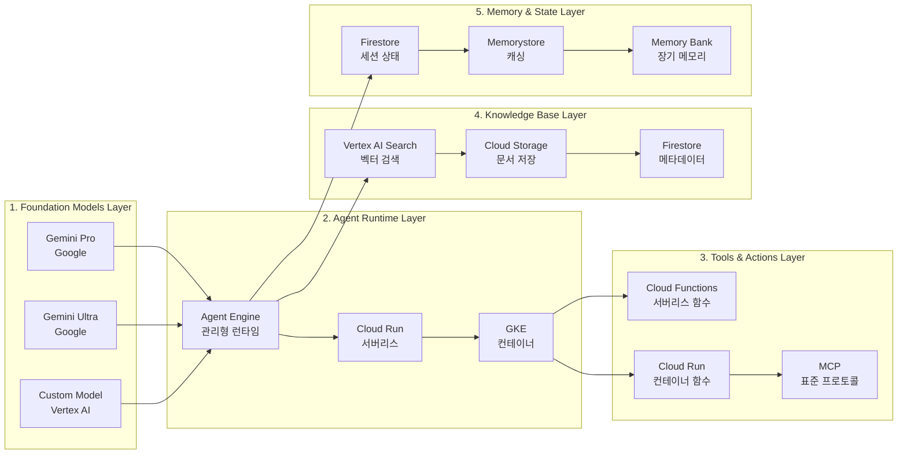
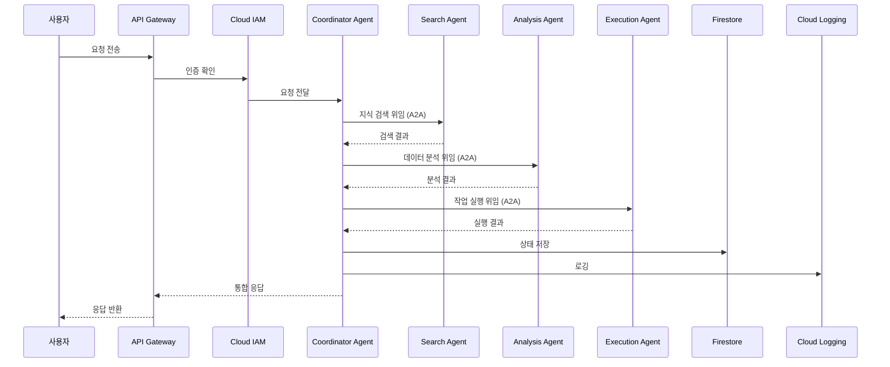
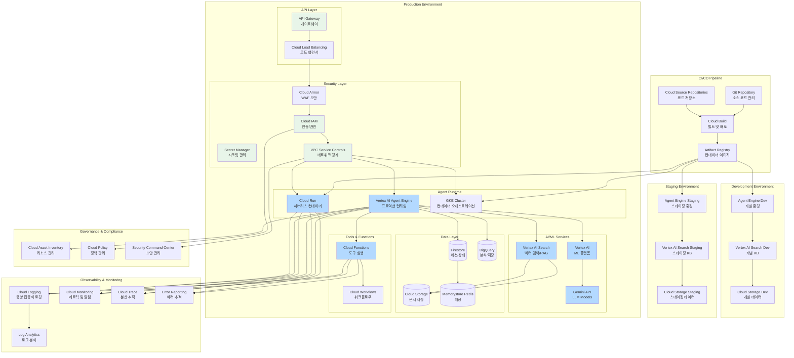

# GCP AI Agent Architecture Best Practices

## 목차
1. [개요](#개요)
2. [핵심 아키텍처 구성요소](#핵심-아키텍처-구성요소)
3. [아키텍처 설계 원칙](#아키텍처-설계-원칙)
4. [Best Practices 상세](#best-practices-상세)
5. [보안 및 거버넌스](#보안-및-거버넌스)
6. [운영 및 모니터링](#운영-및-모니터링)
7. [아키텍처 구성도](#아키텍처-구성도)
8. [Application ↔ Agent 통신 패턴](#application--agent-통신-패턴)
9. [참고 아키텍처 패턴](#참고-아키텍처-패턴)

---

## 개요

GCP의 AI Agent Architecture는 **Vertex AI Agent Engine**과 **Agent Development Kit (ADK)**를 중심으로 한 에이전트 시스템 구축을 위한 아키텍처입니다. 핵심은 **멀티 에이전트 협업**, **표준화된 프로토콜 (A2A, MCP)**, **메모리 관리**, **보안**, **관찰성(Observability)**을 확보하는 것입니다.

### 주요 특징
- **Agent Engine**: 관리형 런타임 환경 제공
- **Agent-to-Agent (A2A) 프로토콜**: 에이전트 간 표준화된 통신
- **Model Context Protocol (MCP)**: 도구 및 외부 시스템과의 표준화된 통합
- **Memory Bank**: 단기 및 장기 메모리 관리
- **다양한 디자인 패턴**: Sequential, Parallel, Loop, Coordinator 등

---

## 핵심 아키텍처 구성요소

### 1. 레이어 구조

| 레이어 | 역할 | 주요 GCP 서비스 |
|--------|------|----------------|
| **Foundation Models** | Agent의 추론 및 계획 수립 | Vertex AI, Gemini API |
| **Agent Runtime** | 에이전트 실행 환경 및 오케스트레이션 | Vertex AI Agent Engine, Cloud Run, GKE |
| **Tools / Actions** | 외부 API 호출, 계산, DB 접근 | Cloud Functions, Cloud Run, API Gateway |
| **Knowledge Base** | 문서, 데이터베이스, 벡터 스토리지 | Vertex AI Search, Firestore, BigQuery |
| **Memory / Session State** | 장기 메모리, 세션 상태, 사용자 히스토리 | Firestore, Memorystore (Redis), Memory Bank |
| **Security & Governance** | 인증/권한, 암호화, Content Safety | IAM, Secret Manager, VPC Service Controls |
| **Observability** | 로그, 추적, 모니터링 | Cloud Logging, Cloud Monitoring, Cloud Trace |

### 2. 주요 GCP 서비스

#### AI/ML 서비스
- **Vertex AI**: 통합 ML 플랫폼 및 모델 관리
- **Vertex AI Agent Engine**: 관리형 에이전트 런타임
- **Vertex AI Search**: 벡터 검색 및 RAG 구현
- **Gemini API**: Google의 최신 LLM 모델
- **Agent Development Kit (ADK)**: 에이전트 개발 프레임워크

#### 오케스트레이션 및 컴퓨팅
- **Cloud Run**: 서버리스 컨테이너 실행
- **Cloud Functions**: 서버리스 함수 실행
- **Google Kubernetes Engine (GKE)**: 컨테이너 오케스트레이션
- **Cloud Workflows**: 워크플로우 오케스트레이션

#### 스토리지 및 데이터베이스
- **Cloud Storage**: 문서 및 객체 저장
- **Firestore**: NoSQL 데이터베이스 및 세션 상태
- **BigQuery**: 데이터 웨어하우스 및 분석
- **Memorystore (Redis)**: 인메모리 캐싱 및 세션 관리

#### 보안 및 거버넌스
- **Cloud IAM**: 접근 제어 및 권한 관리
- **Secret Manager**: 시크릿 및 암호화 키 관리
- **VPC Service Controls**: 네트워크 경계 제어
- **Private Service Connect**: 프라이빗 네트워크 연결

#### 관찰성
- **Cloud Logging**: 중앙 집중식 로깅
- **Cloud Monitoring**: 메트릭 및 알림
- **Cloud Trace**: 분산 추적
- **Error Reporting**: 에러 추적 및 분석

---

## 아키텍처 설계 원칙

### 1. Agent 패턴 선택

#### Single-Agent vs Multi-Agent
- **Single-Agent**: 단순한 목적, 적은 수의 도구 사용 시 적합
- **Multi-Agent**: 복잡한 흐름, 여러 도메인, 다양한 도구 활용 시 적합

#### Multi-Agent 패턴 유형
- **Sequential Pattern**: 순차적 실행, 정형화된 파이프라인
- **Parallel Pattern**: 병렬 실행, 대기 시간 절감
- **Loop/Iterative Refinement Pattern**: 반복을 통한 품질 개선
- **Review & Critique Pattern**: Generator-Critic 구조
- **Coordinator Pattern**: 상위 Agent가 하위 Agent에게 작업 위임
- **Hierarchical Task Decomposition**: 계층적 작업 분해
- **Swarm Pattern**: 다수의 동등한 Agent 협업

### 2. Runtime 환경 선택

#### 선택 기준
| 요구사항 | 권장 Runtime |
|----------|-------------|
| 완전 관리형, Python 기반, 오버헤드 최소화 | Vertex AI Agent Engine |
| 서버리스, 이벤트 중심적, 유연한 스케일링 | Cloud Run |
| 상태 관리, 복잡한 네트워크/컴퓨팅 구성 | GKE 또는 컨테이너 기반 환경 |

### 3. 메모리 및 상태 관리

#### 단기 메모리 (Short-Term Memory)
- **세션 상태**: 대화 컨텍스트, 메시지 히스토리
- **도구 호출 결과**: 최근 실행 결과
- **구현**: Agent Engine 세션, Firestore, Memorystore

#### 장기 메모리 (Long-Term Memory)
- **사용자 프로필**: 지속적인 사용자 정보
- **도메인 지식**: 조직의 지식 베이스
- **상호작용 기록**: 과거 대화 및 결과
- **구현**: Memory Bank, Firestore, BigQuery

### 4. 표준화된 프로토콜 활용

#### Agent-to-Agent (A2A) 프로토콜
- **목적**: 에이전트 간 표준화된 통신
- **장점**: 상호 운용성, 확장성, 유지보수성
- **사용 사례**: 멀티 에이전트 협업, 작업 위임

#### Model Context Protocol (MCP)
- **목적**: 도구 및 외부 시스템과의 표준화된 통합
- **장점**: 일관된 인터페이스, 재사용성
- **사용 사례**: 외부 API 통합, 데이터 소스 연결

---

## Best Practices 상세

### 1. Agent Engine 활용

#### 권장 사항
- **관리형 런타임**: Agent Engine을 통한 빠른 시작
- **내장 기능**: 인증, 세션 관리, 메모리 관리 자동화
- **스케일링**: 자동 스케일링 및 리소스 관리

#### 구현 방법
- Agent Engine 프로젝트 생성
- 에이전트 정의 및 배포
- 세션 관리 및 상태 유지
- 메모리 Bank 활용

### 2. 멀티 에이전트 디자인 패턴

#### 패턴 선택 가이드
- **단순 작업**: Single-Agent 또는 Sequential
- **병렬 가능 작업**: Parallel Pattern
- **반복 개선 필요**: Loop Pattern
- **품질 검증 필요**: Review & Critique Pattern
- **복잡한 작업 분해**: Coordinator 또는 Hierarchical Pattern

#### 구현 예시
```
Coordinator Agent
    ├── Search Agent (지식 검색)
    ├── Analysis Agent (데이터 분석)
    ├── Execution Agent (작업 실행)
    └── Validation Agent (결과 검증)
```

### 3. 도구(Tools) 및 프로토콜 연계

#### 도구 설계 원칙
- **명확한 정의**: 각 도구의 입력/출력 스키마 명확히 정의
- **Allow-list**: 에이전트가 호출 가능한 도구 제한
- **인증 및 권한**: 도구 호출 시 권한 검증

#### MCP 활용
- **표준화된 인터페이스**: MCP를 통한 도구 통합
- **재사용성**: 공통 도구 라이브러리 구축
- **확장성**: 새로운 도구 추가 용이

### 4. 메모리 관리 전략

#### 세션 관리
- **세션 분리**: 사용자별 세션 고유 식별
- **컨텍스트 유지**: 대화 컨텍스트 및 상태 관리
- **리소스 정리**: 세션 종료 시 리소스 정리

#### 장기 메모리 활용
- **Memory Bank**: Agent Engine의 Memory Bank 활용
- **외부 저장소**: Firestore, BigQuery를 통한 지속적 저장
- **요약 및 압축**: 장기 메모리 효율적 관리

### 5. 보안 및 거버넌스

#### IAM 및 접근 제어
- **최소 권한 원칙**: 에이전트별 최소한의 권한만 부여
- **서비스 계정**: 에이전트별 서비스 계정 분리
- **조직 정책**: 조직 수준의 정책 적용

#### VPC Service Controls
- **네트워크 경계**: VPC Service Controls를 통한 네트워크 격리
- **데이터 보호**: 외부 인터넷 접근 차단
- **Private Service Connect**: 프라이빗 연결 활용

### 6. 점진적 확장 전략 (Crawl-Walk-Run)

#### 단계별 접근
1. **Crawl**: 내부 사용자 대상, 제한된 기능
2. **Walk**: 확장된 사용자 그룹, 추가 기능
3. **Run**: 전체 사용자 대상, 멀티 에이전트 협업

#### 이점
- 리스크 감소
- 점진적 학습 및 개선
- 안정성 확보

### 7. 비용 및 성능 최적화

#### 모델 선택 전략
- **경량 모델**: 단순 쿼리, 빠른 응답 필요 시
- **고성능 모델**: 복잡한 분석, 정확도 중요 시
- **도메인 튜닝**: 특정 도메인 데이터로 Fine-tuning

#### 최적화 기법
- **프롬프트 최적화**: 토큰 사용량 최소화
- **캐싱 전략**: 반복적인 응답 캐싱
- **병렬 처리**: 독립적인 작업 병렬 실행
- **비동기 처리**: 장시간 작업은 비동기로 처리

---

## 보안 및 거버넌스

### 1. IAM 및 접근 제어

#### 권한 관리
- **서비스 계정 분리**: 에이전트별 서비스 계정 생성
- **최소 권한 원칙**: 필요한 권한만 부여
- **조직 정책**: 조직 수준의 정책 적용

### 2. Secret Manager를 통한 시크릿 관리

#### 권장 사항
- **API 키 관리**: 외부 API 키를 Secret Manager에 저장
- **연결 문자열**: 데이터베이스 연결 문자열 관리
- **인증서 관리**: SSL/TLS 인증서 관리

### 3. 네트워크 보안

#### VPC Service Controls
- **경계 설정**: VPC Service Controls를 통한 네트워크 경계
- **데이터 보호**: 외부 인터넷 접근 차단
- **Private Service Connect**: 프라이빗 연결 활용

#### Egress 제어
- **Secure Web Proxy**: 외부 API 호출 경로 관리
- **PSC-I**: Private Service Connect Interface 활용
- **불필요한 통신 차단**: 위험한 출구 통신 차단

### 4. 데이터 보호

#### 암호화
- **전송 중 암호화**: TLS 1.2 이상 사용
- **저장 시 암호화**: Cloud Storage 암호화
- **고객 관리형 키 (CMEK)**: 고객이 관리하는 암호화 키

#### 데이터 거주성
- **Data Residency**: 데이터 저장 및 처리 위치 제어
- **규정 준수**: GDPR, HIPAA 등 관련 법규 준수

### 5. 책임 있는 AI (Responsible AI)

#### 구현 사항
- **투명성**: 사용자에게 에이전트의 한계 알림
- **편향 방지**: 모델 편향 모니터링 및 완화
- **프라이버시**: 사용자 데이터 보호 및 개인정보 처리
- **Human-in-the-Loop**: 중요 결정 시 인간 개입

---

## 운영 및 모니터링

### 1. 로깅 및 추적

#### 필수 로그 항목
- **에이전트 호출**: Agent Engine 호출 로그
- **도구 실행**: 도구 호출 로그
- **검색 쿼리**: Vertex AI Search 쿼리 로그
- **프롬프트 및 응답**: 입력/출력 로깅 (민감 정보 제외)

#### 구현 방법
- Cloud Logging을 통한 중앙 집중식 로깅
- 구조화된 로그 형식 사용
- 사용자 정의 차원 및 메트릭 추가

### 2. 모니터링 지표

#### 핵심 지표
- **Latency**: 응답 시간, 각 단계별 지연 시간
- **Error Rate**: 에러 발생률, 실패율
- **Tool Failure Rate**: 도구 호출 실패율
- **Cost**: 토큰 사용량, 비용 추적
- **정확도**: 응답 품질, 사용자 만족도

#### 알림 설정
- 임계값 기반 알림
- 이상 징후 탐지
- 자동화된 대응 메커니즘

### 3. 평가 및 테스트

#### 평가 서비스
- **Example Store**: 예상 응답 예제 저장
- **Evaluation Service**: 자동화된 평가 서비스
- **지표 수집**: 정확도, 관련성, 완전성 측정

#### 테스트 전략
- **단위 테스트**: 개별 에이전트 테스트
- **통합 테스트**: 전체 워크플로우 테스트
- **A/B 테스트**: 프롬프트 및 모델 비교 테스트
- **시나리오 테스트**: 다양한 사용자 시나리오 테스트

### 4. 인프라 자동화 (IaC)

#### 권장 사항
- **Terraform**: 인프라 코드화
- **Deployment Manager**: GCP 네이티브 IaC
- **재현성**: 동일한 환경 재현 가능
- **버전 관리**: 인프라 변경 사항 추적

---

## 아키텍처 구성도

### 전체 아키텍처 개요

다음은 GCP AI Agent Architecture의 전체 구성도를 나타냅니다:



### 멀티 에이전트 Coordinator 패턴



### 레이어별 상세 구성도



### 데이터 흐름도 (Coordinator 패턴)



---

## Production 배포 아키텍처

### GCP AI Agent Production 배포 아키텍처

다음은 GCP에서 AI Agent를 Production 환경에 배포하기 위한 전체 아키텍처입니다:



---

## GCP AI Landing Zone 아키텍처

다음은 GCP에서 AI Agent를 위한 Landing Zone 아키텍처입니다:

```mermaid
graph TB
    subgraph "Organization Level"
        Org[GCP Organization<br/>조직 단위]
        Folders[Folders<br/>리소스 조직]
        Policies[Organization Policies<br/>조직 정책]
    end
    
    subgraph "Network Architecture"
        VPC[VPC Network<br/>가상 네트워크]
        Subnet[Subnets<br/>서브넷]
        PSC[Private Service Connect<br/>프라이빗 연결]
        VPN[Cloud VPN<br/>VPN 연결]
        Interconnect[Cloud Interconnect<br/>전용 연결]
    end
    
    subgraph "Security & Identity"
        IAM[Cloud IAM<br/>인증/권한]
        ServiceAccounts[Service Accounts<br/>서비스 계정]
        WorkloadIdentity[Workload Identity<br/>워크로드 인증]
        SecretMgr[Secret Manager<br/>시크릿 관리]
        KMS[Cloud KMS<br/>키 관리]
    end
    
    subgraph "VPC Service Controls"
        VPSC[VPC Service Controls<br/>네트워크 경계]
        Perimeter[Service Perimeter<br/>서비스 경계]
        AccessLevel[Access Context Manager<br/>접근 레벨]
    end
    
    subgraph "AI Agent Projects"
        subgraph "Shared Services Project"
            SharedVPC[Shared VPC<br/>공유 VPC]
            DNS[Cloud DNS<br/>DNS 관리]
            NAT[Cloud NAT<br/>NAT 게이트웨이]
        end
        
        subgraph "AI Platform Project"
            VertexAI[Vertex AI<br/>ML 플랫폼]
            AgentEngine[Agent Engine<br/>에이전트 런타임]
            VertexSearch[Vertex AI Search<br/>벡터 검색]
        end
        
        subgraph "Data Project"
            BigQuery[BigQuery<br/>데이터 웨어하우스]
            CloudStorage[Cloud Storage<br/>객체 저장소]
            Firestore[Firestore<br/>NoSQL DB]
        end
        
        subgraph "Compute Project"
            CloudRun[Cloud Run<br/>서버리스]
            GKE[GKE<br/>컨테이너]
            CloudFunctions[Cloud Functions<br/>서버리스 함수]
        end
        
        subgraph "Security Project"
            SecurityCommand[Security Command Center<br/>보안 관리]
            CloudArmor[Cloud Armor<br/>WAF/DDoS]
            CloudPolicy[Cloud Policy<br/>정책 관리]
        end
        
        subgraph "Observability Project"
            CloudLogging[Cloud Logging<br/>로깅]
            CloudMonitoring[Cloud Monitoring<br/>모니터링]
            CloudTrace[Cloud Trace<br/>추적]
        end
    end
    
    subgraph "External Connections"
        Internet[Internet<br/>인터넷]
        OnPrem[On-Premises<br/>온프레미스]
        Partners[Partner Networks<br/>파트너 네트워크]
    end
    
    Org --> Folders
    Folders --> Policies
    Policies --> VPSC
    
    VPC --> Subnet
    VPC --> PSC
    VPC --> VPN
    VPC --> Interconnect
    
    IAM --> ServiceAccounts
    ServiceAccounts --> WorkloadIdentity
    SecretMgr --> KMS
    
    VPSC --> Perimeter
    Perimeter --> AccessLevel
    
    SharedVPC --> DNS
    SharedVPC --> NAT
    
    Folders --> SharedVPC
    Folders --> VertexAI
    Folders --> BigQuery
    Folders --> CloudRun
    Folders --> SecurityCommand
    Folders --> CloudLogging
    
    VertexAI --> AgentEngine
    VertexAI --> VertexSearch
    
    AgentEngine --> CloudRun
    AgentEngine --> GKE
    AgentEngine --> CloudFunctions
    
    AgentEngine --> BigQuery
    AgentEngine --> CloudStorage
    AgentEngine --> Firestore
    
    Perimeter --> VertexAI
    Perimeter --> BigQuery
    Perimeter --> CloudRun
    Perimeter --> CloudStorage
    
    PSC --> Internet
    VPN --> OnPrem
    Interconnect --> Partners
    
    CloudArmor --> Internet
    SecurityCommand --> VertexAI
    SecurityCommand --> CloudRun
    SecurityCommand --> BigQuery
    
    CloudLogging --> VertexAI
    CloudLogging --> CloudRun
    CloudMonitoring --> VertexAI
    CloudMonitoring --> CloudRun
    
    style VertexAI fill:#B3D9FF
    style AgentEngine fill:#B3D9FF
    style VertexSearch fill:#B3D9FF
    style CloudRun fill:#B3D9FF
    style CloudFunctions fill:#B3D9FF
    style VPSC fill:#E8F5E9
    style IAM fill:#E8F5E9
    style SecurityCommand fill:#E8F5E9
    style Perimeter fill:#E8F5E9
```



---

## 배포 파이프라인 아키텍처

```mermaid
graph LR
    subgraph "Source Control"
        Git[Git Repository]
        CloudSource[Cloud Source Repositories]
    end
    
    subgraph "Build & Test"
        CloudBuild[Cloud Build<br/>CI/CD]
        UnitTest[Unit Tests<br/>단위 테스트]
        IntegrationTest[Integration Tests<br/>통합 테스트]
        EvalTest[Evaluation Tests<br/>평가 테스트]
    end
    
    subgraph "Artifact Management"
        ArtifactReg[Artifact Registry<br/>컨테이너 이미지]
        GCSArtifacts[Cloud Storage<br/>배포 아티팩트]
    end
    
    subgraph "Deployment Environments"
        Dev[Development<br/>개발 환경]
        Staging[Staging<br/>스테이징 환경]
        Prod[Production<br/>프로덕션 환경]
    end
    
    subgraph "Production Components"
        AgentEngine[Agent Engine]
        CloudRun[Cloud Run]
        GKE[GKE]
        VertexSearch[Vertex AI Search]
    end
    
    subgraph "Monitoring & Rollback"
        Monitoring[Cloud Monitoring]
        Logging[Cloud Logging]
        Rollback[Auto Rollback]
    end
    
    Git --> CloudSource
    CloudSource --> CloudBuild
    CloudBuild --> UnitTest
    UnitTest --> IntegrationTest
    IntegrationTest --> EvalTest
    EvalTest --> ArtifactReg
    EvalTest --> GCSArtifacts
    
    ArtifactReg --> Dev
    ArtifactReg --> Staging
    ArtifactReg --> Prod
    
    Dev --> Staging
    Staging --> Prod
    
    Prod --> AgentEngine
    Prod --> CloudRun
    Prod --> GKE
    Prod --> VertexSearch
    
    AgentEngine --> Monitoring
    CloudRun --> Monitoring
    GKE --> Monitoring
    VertexSearch --> Monitoring
    
    Monitoring --> Logging
    Monitoring --> Rollback
    Rollback --> Prod
    
    style CloudBuild fill:#B3D9FF
    style AgentEngine fill:#B3D9FF
    style CloudRun fill:#B3D9FF
    style VertexSearch fill:#B3D9FF
```



---

## Application ↔ Agent 통신 패턴

### 1. 동기/비동기 혼합 패턴 (Hybrid Pattern)

#### Vertex AI Agent Engine 기본 통신
- **특징**: 
  - 동기 호출과 비동기 워크플로우 모두 지원
  - Agent Engine이 관리형 런타임으로 통신 처리
  - Sessions API를 통한 세션 기반 상태 관리
- **사용 사례**:
  - 다양한 작업 유형 지원
  - 유연한 통신 패턴 선택

#### 구현 예시
```python
# Agent Engine을 통한 호출
from google.cloud import aiplatform

# Agent Engine 배포된 에이전트 호출
agent = aiplatform.AgentEngine(agent_id=agent_id)
response = agent.invoke(
    session_id=session_id,
    message=user_message
)
```

### 2. 동기 호출 패턴 (Synchronous Invocation)

#### 직접 API 호출
- **용도**: 즉시 응답이 필요한 간단한 작업
- **특징**:
  - Vertex AI API 직접 호출
  - 낮은 지연 시간
  - Streaming 응답 지원
- **사용 사례**:
  - 간단한 질의응답
  - 빠른 정보 검색
  - 실시간 채팅

#### 구현 예시
```python
# Vertex AI API 동기 호출
from vertexai.generative_models import GenerativeModel

model = GenerativeModel("gemini-pro")
response = model.generate_content(
    prompt=user_message,
    stream=True  # Streaming 지원
)
```

#### 장점
- 낮은 지연 시간
- 실시간 사용자 피드백
- 간단한 구현

#### 단점
- 타임아웃 제약
- 장시간 작업에 부적합

### 3. 비동기 호출 패턴 (Asynchronous Invocation)

#### Cloud Pub/Sub를 통한 비동기 메시징
- **용도**: 장시간 실행 작업, 배치 처리, 이벤트 기반 아키텍처
- **특징**:
  - 메시지 큐 기반 통신
  - 확장 가능한 처리
  - 작업 상태 추적
- **사용 사례**:
  - 복잡한 분석 작업
  - 리포트 생성
  - 배치 처리
  - 멀티 에이전트 협업

#### 구현 예시
```python
# Pub/Sub를 통한 비동기 작업 트리거
from google.cloud import pubsub_v1

publisher = pubsub_v1.PublisherClient()
topic_path = publisher.topic_path(project_id, topic_name)

message_data = json.dumps({
    'agent_id': agent_id,
    'session_id': session_id,
    'user_message': user_message
}).encode('utf-8')

future = publisher.publish(topic_path, message_data)
message_id = future.result()
```

#### Cloud Workflows를 통한 워크플로우 오케스트레이션
- **용도**: 복잡한 멀티스텝 에이전트 작업
- **특징**:
  - YAML 기반 워크플로우 정의
  - 에러 처리 및 재시도 자동화
  - 각 단계별 상태 추적
- **구성 요소**:
  - HTTP 호출 (Agent Engine)
  - Cloud Functions 실행
  - 조건부 분기
  - 상태 저장

### 4. Agent-to-Agent (A2A) 프로토콜

#### 표준화된 에이전트 간 통신
- **용도**: 멀티 에이전트 협업, Coordinator 패턴
- **특징**:
  - 개방형 프로토콜 표준
  - 에이전트 간 직접 통신
  - 메시지 기반 통신
- **사용 사례**:
  - Coordinator Agent가 하위 Agent에게 작업 위임
  - 여러 전문화된 Agent 협업
  - 복잡한 워크플로우 처리

#### 구현 예시
```python
# A2A 프로토콜을 통한 에이전트 간 통신
coordinator_agent.send_message(
    target_agent_id=search_agent_id,
    message={
        'task': 'search',
        'query': user_query,
        'context': session_context
    }
)
```

### 5. Sessions 및 Memory Bank

#### 세션 기반 상태 관리
- **Sessions API**: 사용자-에이전트 상호작용을 세션 단위로 저장
- **Memory Bank**: 단기 및 장기 메모리 관리
- **특징**:
  - 세션 ID 기반 컨텍스트 유지
  - 비동기 작업 시에도 컨텍스트 보존
  - 메모리 검색 및 활용

#### 구현 예시
```python
# Sessions API를 통한 세션 관리
from google.cloud import aiplatform

# 세션 생성
session = aiplatform.Session.create(
    agent_id=agent_id,
    user_id=user_id
)

# 세션에 메시지 추가
session.add_message(
    role='user',
    content=user_message
)

# 에이전트 응답
response = session.invoke()
```

### 6. 통신 패턴 선택 기준

#### 동기 호출이 적합한 경우
- ✅ 즉시 응답이 필요한 사용자 인터랙션
- ✅ 짧은 처리 시간 (< 5초)
- ✅ 실시간 피드백이 중요한 UX
- ✅ 단순한 질의응답

#### 비동기 호출이 적합한 경우
- ✅ 장시간 실행 작업 (분석, 리포트 생성)
- ✅ 멀티스텝 워크플로우 (여러 Tool 호출 필요)
- ✅ 백그라운드 작업 (이메일 발송, 데이터 처리)
- ✅ 배치 처리 작업

#### A2A 프로토콜이 적합한 경우
- ✅ 멀티 에이전트 협업
- ✅ Coordinator 패턴 구현
- ✅ 복잡한 워크플로우 분산 처리

### 7. ReAct, CoT, ToT 패턴과 통신 방식

#### ReAct (Reasoning + Acting)
- **통신 방식**: 주로 동기 호출
- **특징**: 판단과 실행을 연속적으로 수행
- **예시**: "받은 이메일 → 미팅 요청 감지 → 캘린더 자동 등록"

#### Chain of Thought (CoT)
- **통신 방식**: 동기 또는 비동기 (작업 복잡도에 따라)
- **특징**: 단계적 사고 전개
- **예시**: "출장 준비 → 항공권 검색 → 숙소 비교 → 일정 조정"

#### Tree of Thought (ToT)
- **통신 방식**: 비동기 처리 권장
- **특징**: 병렬 아이디어 탐색 후 결정
- **예시**: "여러 옵션 병렬 탐색 → 최적 선택"

### 8. 에러 처리 및 재시도

#### 동기 호출 에러 처리
- 타임아웃 처리
- 재시도 로직 (Exponential Backoff)
- Fallback 응답 제공

#### 비동기 호출 에러 처리
- Pub/Sub Dead Letter Topic 활용
- Cloud Workflows의 에러 핸들링
- 사용자 알림 메커니즘 (Cloud Functions, Cloud Tasks)

#### A2A 통신 에러 처리
- 메시지 전달 실패 시 재시도
- 에이전트 간 타임아웃 처리
- Fallback 에이전트 지정

### 9. 참고 자료

- [Vertex AI Agent Engine 배포 가이드](https://cloud.google.com/vertex-ai/generative-ai/docs/reasoning-engine/deploy)
- [Vertex AI Sessions API](https://cloud.google.com/vertex-ai/generative-ai/docs/reasoning-engine/sessions)
- [Cloud Pub/Sub Documentation](https://cloud.google.com/pubsub/docs)
- [Cloud Workflows Documentation](https://cloud.google.com/workflows/docs)
- [Agentic AI 디자인 패턴 선택 가이드](https://cloud.google.com/architecture/choose-agentic-ai-architecture-design-pattern)

---

## 참고 아키텍처 패턴

### 1. Single-Agent 패턴

```
사용자 입력
    ↓
Agent Engine
    ↓
도구 선택
    ↓
도구 실행 (Cloud Functions)
    ↓
응답 생성
    ↓
Cloud Logging (로깅)
```

### 2. Coordinator 패턴

```
사용자 입력
    ↓
Coordinator Agent
    ├── Search Agent → Vertex AI Search
    ├── Analysis Agent → BigQuery
    ├── Execution Agent → Cloud Functions
    └── Validation Agent → Content Safety
    ↓
결과 통합
    ↓
응답 생성
```

### 3. Parallel 패턴

```
사용자 입력
    ↓
Agent Engine
    ├── Agent 1 (병렬 실행)
    ├── Agent 2 (병렬 실행)
    └── Agent 3 (병렬 실행)
    ↓
결과 통합
    ↓
응답 생성
```

### 4. Loop/Refinement 패턴

```
초기 응답 생성
    ↓
품질 평가
    ↓
개선 필요?
    ├── Yes → 반복 개선
    └── No → 최종 응답
```

---

## 체크리스트

### 설계 단계
- [ ] Agent 패턴 선택 (Single vs Multi)
- [ ] Runtime 환경 선택 (Agent Engine vs Cloud Run vs GKE)
- [ ] 메모리 관리 전략 수립
- [ ] 보안 요구사항 정의
- [ ] 모니터링 및 로깅 전략 수립

### 구현 단계
- [ ] IAM 최소 권한 원칙 적용
- [ ] VPC Service Controls 설정
- [ ] Agent Engine 또는 런타임 구성
- [ ] 도구 정의 및 통합
- [ ] 메모리 관리 구현
- [ ] 에러 처리 및 Fallback 메커니즘 구현

### 운영 단계
- [ ] Cloud Monitoring 대시보드 구축
- [ ] 알림 설정
- [ ] 정기적인 보안 검토
- [ ] 성능 최적화
- [ ] 비용 모니터링
- [ ] 평가 서비스 구축

---

## 참고 자료

- **GCP Landing Zone 및 플랫폼 아키텍처**
  - [Google Cloud Landing Zone 설계 가이드 (공식)](https://docs.cloud.google.com/architecture/landing-zones)  
  - [GCP Landing Zone 전체 가이드 (개념 + 다이어그램)](https://mycloudwiki.com/cloud-landing-zone/google-cloud/complete-guide-on-gcp-landing-zones/3/)  
  - [Google Cloud Architecture Center (도메인별 레퍼런스 아키텍처 모음)](https://docs.cloud.google.com/architecture)

- **GCP AI Agent / Agentic AI 아키텍처**
  - [Vertex AI Agent Engine / Vertex AI 개요](https://cloud.google.com/vertex-ai/docs)  
  - [Vertex AI Agent Builder 제품 소개](https://cloud.google.com/products/agent-builder)  
  - [Vertex AI Agent Builder 개요 및 워크플로 (Overview + Diagram)](https://docs.cloud.google.com/agent-builder/overview)  
  - [Multi-Agent AI System Reference Architecture](https://cloud.google.com/architecture/multiagent-ai-system)  
  - [Agentic AI 컴포넌트 선택 가이드](https://cloud.google.com/architecture/choose-agentic-ai-architecture-components)  
  - [Agentic AI 디자인 패턴 선택 가이드](https://cloud.google.com/architecture/choose-agentic-ai-architecture-design-pattern)  
  - [Building Scalable AI Agents: Design Patterns (파트너 블로그)](https://cloud.google.com/blog/topics/partners/building-scalable-ai-agents-design-patterns-with-agent-engine-on-google-cloud)  
  - [Codelab: Vertex AI로 AI Agent 빌드/배포 예제](https://codelabs.developers.google.com/devsite/codelabs/building-ai-agents-vertexai)


